<div align="center">


# 🧠 PersistenceAI

### **Agentic Coding Multiplexer IDE**

<div align="center">

**📦 Latest Release:** [](https://github.com/Persistence-AI/Landing/releases/latest) • [](https://github.com/Persistence-AI/Landing/releases)

</div>

[](https://persistence-ai.github.io/Landing/)
[](https://www.linkedin.com/in/leo-l-29171422b)
[](https://x.com/AiPersiste65218)
[](mailto:PersistenceAI@proton.me)

---

</div>

## 🎯 Overview

**PersistenceAI** is an enterprise-grade **Agentic Coding Multiplexer IDE** that revolutionizes software development by integrating multiple AI agents directly into your terminal workflow. Built for professional development teams seeking intelligent automation and enhanced productivity.

<div align="center">

### **Enterprise-Ready • Production-Tested • Developer-Focused**

</div>

---

## ⚡ Why PersistenceAI?

- **🤖 Multi-Agent System** - Unlike single-agent tools, coordinate multiple specialized AI agents for complex tasks
- **💻 Terminal-Native** - Full IDE experience without leaving your terminal workflow
- **🧠 Persistent Context** - AI agents remember your project context across sessions
- **🏢 Enterprise-Ready** - Built for professional development teams with production-grade reliability
- **🔌 Flexible Integration** - Support for local models (Ollama) and cloud providers (OpenAI, Anthropic, Google, etc.)

---

## 🖥️ Preview

<div align="center">

### Home Screen


### Multi-Pane Interface


*Terminal IDE with AI Chat, File Explorer, and Code Editor - All in your terminal*

</div>

---

## ✨ Core Capabilities

<table>
<tr>
<td width="50%">

### 🤖 **Multi-Agent Architecture**
- **Oligarchy Agent** - Consensus-based decision making with voting
- **Specialized Agents** - Build, Plan, Review, Debug agents with specific roles
- **Subagents** - Invoke specialized agents via @ mentions
- **Parallel Execution** - Multiple agents work simultaneously on different tasks
- **Context-Aware Communication** - Agents share context and coordinate automatically

</td>
<td width="50%">

### 💻 **Terminal IDE Experience**
- **Full-Featured Editor** - Multi-file editing with syntax highlighting
- **Code Completion** - LSP-powered autocomplete and IntelliSense
- **Go to Definition** - Navigate codebase with F12 or Ctrl+G
- **Real-Time Diagnostics** - Error detection and warnings as you type
- **File Explorer** - Navigate projects with integrated file tree
- **Search & Replace** - Find and replace across files

</td>
</tr>
<tr>
<td width="50%">

### 🔄 **Persistent Memory System**
- **Cross-Session Memory** - AI agents remember context across sessions
- **Automatic Compaction** - Long conversations are automatically summarized
- **Workspace Persistence** - Project state and sessions are saved
- **Contextual Generation** - Code generation based on full project context
- **Episodic & Semantic Memory** - Both short-term and long-term context retention

</td>
<td width="50%">

### 🛠️ **Enterprise Tool Integration**
- **Multi-Provider Support** - OpenAI, Anthropic, Google, Ollama, and more
- **Model Context Protocol (MCP)** - Connect to external tools and services
- **Language Server Protocol (LSP)** - Full IDE features with any LSP server
- **Custom Tools** - Build and integrate custom tools for your workflow
- **CI/CD Compatible** - Works seamlessly with existing development pipelines

</td>
</tr>
</table>

---

## 💡 Use Cases

- **🔧 Code Refactoring** - Multi-agent collaboration for complex refactoring tasks
- **🐛 Bug Fixing** - AI agents analyze errors, suggest fixes, and implement solutions
- **✨ Feature Development** - Plan, implement, and review features with AI assistance
- **📝 Code Review** - Automated code quality checks and improvements
- **📚 Documentation** - Generate and maintain project documentation automatically
- **🚀 Rapid Prototyping** - Quickly build and iterate on new features
- **🔍 Codebase Exploration** - Understand large codebases with specialized agents

---

## 🧠 Quick Start

### Installation

<div align="center">

**Windows** | **Linux/macOS**

</div>

<div align="center">

```powershell
iwr -useb https://persistence-ai.github.io/Landing/install | iex
```

```bash
curl -fsSL https://persistence-ai.github.io/Landing/install | bash
```

</div>

### Package Managers

```bash
npm install -g persistenceai    # Node.js
bun install -g persistenceai    # Bun
pnpm install -g persistenceai   # pnpm
brew install persistenceai       # Homebrew (macOS)
```

### Quick Example

```bash
# Start PersistenceAI in your project
pai tui

# Ask for help with a feature
@build Can you help me implement user authentication?

# Multiple agents collaborate automatically:
# - Planning agent creates the architecture
# - Build agent implements the code
# - Review agent checks for issues
```

---

## 📊 Enterprise Features

<div align="center">

| Feature | Status | Description |
|---------|--------|-------------|
| **Multi-Agent System** | ✅ Production | Orchestrate multiple AI agents for complex tasks |
| **Terminal IDE** | ✅ Production | Full IDE features with LSP support |
| **Persistent Memory** | ✅ Production | Context retention across sessions |
| **Tool Integration** | ✅ Production | Seamless workflow integration |
| **Package Managers** | 🚧 Coming Soon | Native package manager support |
| **GitHub Integration** | 🚧 In Development | Direct GitHub Actions integration |

</div>

---

## 🏗️ Architecture

```mermaid
flowchart TB
    subgraph Input["User Input Layer"]
        UI["Terminal Commands<br/>Chat Messages<br/>File Operations<br/>@ Mentions"]
    end
    
    subgraph Agents["Agent Layer"]
        A1["Primary Agent<br/>(Build/Plan)"]
        A2["Primary Agent<br/>(Review)"]
        A3["Primary Agent<br/>(Custom)"]
        A4["Subagent Agents<br/>(@mentions)"]
    end
    
    subgraph Orchestrator["Orchestrator & Memory System"]
        CE["Context Engine<br/>• Prompt Build<br/>• Agent Select<br/>• Tool Routing"]
        MS["Memory System<br/>• Episodic<br/>• Semantic<br/>• Session State"]
        TD["Task Decomp<br/>• Hierarchical<br/>• Recursive<br/>• Validation"]
        VC["Voting & Consensus<br/>(Oligarchy Agent)"]
    end
    
    subgraph Tools["Tool Execution Layer"]
        F["Files<br/>(R/W)"]
        S["Search<br/>(grep)"]
        E["Execute<br/>(bash)"]
        C["Custom<br/>Tools"]
    end
    
    subgraph IDE["Terminal IDE & Tool Interface"]
        Chat["AI Chat Interface<br/>• User Messages<br/>• Agent Responses<br/>• Tool Results"]
        Explorer["Explorer Pane<br/>• File Tree<br/>• Navigation<br/>• File Selection<br/>• @ File Search"]
        Editor["Editor Pane<br/>• Text Editor<br/>• Syntax Highlight<br/>• Search/Replace<br/>• Undo/Redo<br/>• Multi-file"]
        LSP["LSP/MCP Integration<br/>• Language Server Protocol<br/>• Model Context Protocol<br/>• Code Completion<br/>• Diagnostics"]
    end
    
    subgraph Response["Response & Feedback"]
        RF["Code Changes<br/>Explanations<br/>Tool Results<br/>Error Handling"]
    end
    
    subgraph Memory["Memory System"]
        Mem["Persist Context"]
    end
    
    UI --> Agents
    A1 --> Orchestrator
    A2 --> Orchestrator
    A3 --> Orchestrator
    A4 --> Orchestrator
    
    CE --> VC
    MS --> VC
    TD --> VC
    
    VC --> Tools
    F --> IDE
    S --> IDE
    E --> IDE
    C --> IDE
    
    Tools --> Chat
    Chat --> Explorer
    Chat --> Editor
    Explorer <--> Editor
    IDE --> LSP
    
    IDE --> Response
    Response --> Memory
    Memory --> Orchestrator
    
    style Input fill:#161b22,stroke:#4ec9b0,stroke-width:2px
    style Agents fill:#161b22,stroke:#4ec9b0,stroke-width:2px
    style Orchestrator fill:#161b22,stroke:#4ec9b0,stroke-width:2px
    style Tools fill:#161b22,stroke:#4ec9b0,stroke-width:2px
    style IDE fill:#161b22,stroke:#4ec9b0,stroke-width:2px
    style Response fill:#161b22,stroke:#4ec9b0,stroke-width:2px
    style Memory fill:#161b22,stroke:#4ec9b0,stroke-width:2px
```



**Data Flow:** User Input → Agent Selection → Orchestrator → Tool Execution → IDE Interface → Response → Memory Update → (Loop)

---

## 📚 Resources

<div align="center">

| Resource | Link | Description |
|----------|------|-------------|
| 🌐 **Website** | [persistence-ai.github.io/Landing](https://persistence-ai.github.io/Landing/) | Main website and documentation |
| 📖 **Documentation** | [Documentation](https://persistence-ai.github.io/Landing/docs/) | Comprehensive user and developer guides |
| 🎙️ **Podcast** | [Podcast](https://persistence-ai.github.io/Landing/podcast.html) | Listen to our podcast about AI development |
| 🐛 **Issue Tracker** | [GitHub Issues](https://github.com/Persistence-AI/.github/issues) | Report bugs and request features |
| 💡 **Feature Requests** | [GitHub Issues](https://github.com/Persistence-AI/.github/issues) | Suggest new features and improvements |

</div>

---

## 🔒 Project Status

<div align="center">

**PersistenceAI is currently a closed-source, enterprise product.**

</div>

### Repository Structure

```
Persistence-AI/
├── Landing/              # Public website and documentation
├── .github/              # Organization-wide files (this repo)
└── [Private Repos]       # Core codebase (proprietary)
```

### Selective Open Source

Some components may be selectively open-sourced in the future:
- **CLI Wrappers** - Installation and deployment tools
- **Example Integrations** - Sample code and templates
- **Documentation Tools** - Documentation generation utilities
- **Select Utilities** - Non-proprietary helper tools

**Core codebase remains proprietary and enterprise-focused.**

---

## 🔐 Security & Privacy

- **🔒 Local-First** - Run models locally with Ollama for complete privacy
- **🔑 Secure Credentials** - API keys stored securely in user config
- **💾 Session Privacy** - All session data stays on your machine
- **🏢 Enterprise Compliance** - Ready for enterprise security requirements
- **🌐 Provider Choice** - Use any provider or self-host for maximum control

---

## 🗺️ Roadmap

- [ ] **Q1 2025** - Package manager support (npm, Homebrew, Chocolatey, Scoop)
- [ ] **Q2 2025** - GitHub Actions integration and CI/CD workflows
- [ ] **Q3 2025** - VS Code extension for seamless IDE integration
- [ ] **Q4 2025** - IDE feature improvements with editor pane
- [ ] **Q1 2026** - PersistenceTerminal emulation for application
- [ ] **Future** - Cloud sync and team collaboration features

---

## 🤝 Feedback & Support

We value your feedback and are committed to continuous improvement.

<div align="center">

| Channel | Purpose | Response Time |
|---------|---------|---------------|
| 🐛 **Bug Reports** | Report issues and bugs | 24-48 hours |
| 💡 **Feature Requests** | Suggest new features | 3-5 business days |
| 📧 **Email Support** | Direct inquiries | 1-2 business days |
| ⭐ **GitHub Stars** | Show your support | - |

</div>

### How to Provide Feedback

1. **Report Bugs** - Open an issue with detailed reproduction steps
2. **Suggest Features** - Share your ideas and use cases
3. **Improve Documentation** - Help us make docs better (for public repos)
4. **Share Feedback** - Contact us directly via email

---

## 📦 Releases

<div align="center">

**Latest Version:** `1.0.13`

[](https://github.com/Persistence-AI/Landing/releases)
[](https://github.com/Persistence-AI/Landing/releases)

</div>

### Recent Releases

| Version | Date | Type | Highlights |
|---------|------|------|------------|
| [1.0.13](https://github.com/Persistence-AI/Landing/releases/tag/v1.0.13) | 2025-12-30 | Patch | Chat command fixes |
| [1.0.12](https://github.com/Persistence-AI/Landing/releases/tag/v1.0.12) | 2025-12-27 | Patch | Visual improvements, file navigation |
| [1.0.11](https://github.com/Persistence-AI/Landing/releases/tag/v1.0.11) | 2025-12-23 | Patch | ESLint integration |
| [1.0.10](https://github.com/Persistence-AI/Landing/releases/tag/v1.0.10) | 2025-12-20 | Patch | Major upgrade |
| [1.0.09](https://github.com/Persistence-AI/Landing/releases/tag/v1.0.09) | 2025-12-16 | Patch | Toast notifications, changelog |
| [1.0.08](https://github.com/Persistence-AI/Landing/releases/tag/v1.0.08) | 2025-12-13 | Patch | Model branding |
| [1.0.07](https://github.com/Persistence-AI/Landing/releases/tag/v1.0.07) | 2025-12-09 | Patch | Workspace directory fixes |
| [1.0.06](https://github.com/Persistence-AI/Landing/releases/tag/v1.0.06) | 2025-12-06 | Patch | Session restore fixes |
| [1.0.05](https://github.com/Persistence-AI/Landing/releases/tag/v1.0.05) | 2025-12-02 | Patch | Homepage UI redesign |
| [1.0.04](https://github.com/Persistence-AI/Landing/releases/tag/v1.0.04) | 2025-11-28 | Patch | Version merge |
| [1.0.03](https://github.com/Persistence-AI/Landing/releases/tag/v1.0.03) | 2025-11-25 | Patch | Chat scroll bar |
| [1.0.02](https://github.com/Persistence-AI/Landing/releases/tag/v1.0.02) | 2025-11-21 | Patch | Agent system enhancements |
| [1.0.01](https://github.com/Persistence-AI/Landing/releases/tag/v1.0.01) | 2025-11-14 | Initial | First release with core features |

### Release Channels

- **Stable** - Production-ready releases
- **Beta** - Pre-release testing (coming soon)
- **Nightly** - Development builds (internal)

### 📋 Full Release History

- **Changelog:** [CHANGELOG.md](https://github.com/Persistence-AI/Landing/blob/main/CHANGELOG.md)
- **All Releases:** [GitHub Releases](https://github.com/Persistence-AI/Landing/releases)
- **Release Notes:** [RELEASES.md](https://github.com/Persistence-AI/.github/blob/main/RELEASES.md)

---

## 📈 Project Metrics

<div align="center">

[](https://github.com/Persistence-AI/Landing)
[](https://github.com/Persistence-AI/Landing)
[](https://persistence-ai.github.io/Landing/)
[](https://github.com/Persistence-AI/Landing/releases/latest)

</div>

---

## 📧 Enterprise Contact

<div align="center">

**For enterprise inquiries, partnerships, or technical support:**

📧 **Email:** [PersistenceAI@proton.me](mailto:PersistenceAI@proton.me)  
💼 **LinkedIn:** [Connect with us](https://www.linkedin.com/in/leo-l-29171422b)  
🐦 **Twitter/X:** [Follow us](https://x.com/AiPersiste65218)  
🌐 **Website:** [persistence-ai.github.io/Landing](https://persistence-ai.github.io/Landing/)

</div>

---

<div align="center">

### **Built for Enterprise • Designed for Developers**

**Made with ❤️ by the PersistenceAI Team**

[](https://github.com/Persistence-AI)

---

**© 2025 PersistenceAI. All rights reserved.**

</div>
